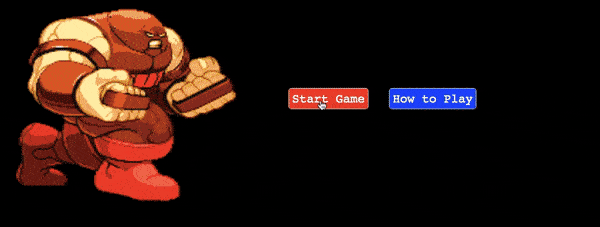

<h1 style="text-align: center; font-weight: bold">Juggernaut's Revenge</h1>

[Live Link](https://juggernaut-s-revenge.firebaseapp.com)

<!--  -->


Juggernaut’s Revenge is a side scroller, typing exercise game involving the X-Men’s Juggernaut villain running into brick walls that you have to type his way through.  

## Technologies Utilized

-Vanilla Javascript
-HTML
-CSS
-Webpack
-Canvas
-Firebase

### Start Game 




The start screen displays a gif of the Juggernaut beside the start button. Clicking the "How to Play" button renders a modal to the screen with game instructions. An event listener was added to the start button which attaches a display none class to the start screen revealing the canvas element behind it. The button also triggers the initial rendering of the game, and plays the arcade music. 

```js
  startButton.addEventListener('click', (e) => {
    startScreen.classList.add('displaynone');

    juggernautGame.arcadeMusic.play();

    juggernautGame.render();
    sentenceInput.focus();
  });
```

Users get to type their way through five levels. Differences between levels include new sentences being unlocked and new walls to smash being made available. Upon reaching a new level, an animated level-info tag is displayed for a brief period to alert the user of how the new level is distinct from previous levels. 

### New Level Animation


New level information was handled with a renderLevelInfo method defined on the game class. The level-info elements were gotten by id, and their innerHTML attributes were re-assigned the information of the immediate level. The rendering of the walls smashed count in the top level of the game was achieved by similar means of modifying the innerHTML of a selected wall-count element. A display none global class gets re-attached to the level-info element after a period of time assigned through a setTimeout function. 

```js
  renderLevelInfo() {
    let levelInfoParagraph1 = document.getElementById("level-info-p-tag1");
    let levelInfoParagraph2 = document.getElementById("level-info-p-tag2");
    if (this.level === 2) {
      this.levelInfo.classList.remove("displaynone");
      levelInfoParagraph1.innerHTML = "LEVEL 2!";
      levelInfoParagraph2.innerHTML = "You've unlocked new sentences!";
      setTimeout(this.removeLevelInfo, 1000);
    }
    ... 
```

### Juggernaut Animation 

The animation of the Juggernaut was handled through a modified spritesheet and a variable keeping track of the frameCount. Upon the user successfully entering in the target sentence, a switch variable monitoring the "breakable" status of the wall gets flipped, and the animation rate is sped up. The logic for the animation speed of the Juggernaut was abstracted into a juggernautLoopIterate method. 

```js
  juggernautLoopIterate() {
    if (this.frameCount > 15 && !this.breakable) {
      this.currentLoopIndex++;
      this.frameCount = 0;
    }
    if (this.frameCount > 5 && this.breakable) {
      this.currentLoopIndex++;
      this.frameCount = 0;
    } 
  }
```

### Wall Movement and Breaking 

The wall's movement also is sped up upon successful entry of the target sentence and the flipping of the breakable variable to true. This logic was handled by passing the wall speed into the wall's render method called within the game's render. An instance variable tracking the x coordinates of the wall decrements by the given speed upon every cycle of the render. The breaking of the wall was handled with the drawImage canvas method and the monitoring of the wall's x coordinates with respect to the Juggernaut's x coordinates. 

Upon reaching the Juggernaut's coordinates, a bricksBreaking audio is executed and a new section of the given wall's spritesheet gets drawn for the remainder of the wall's existence. The next wall's render triggers a reset of both the speed and a rendering of a new, randomized wall. 

### Game Over and Game Restart


If a user does not type a sentence in time, an animated gameover HTML element is overlayed onto the frozen canvas screen. Clicking anywhere within this game over screen triggers a rendering of a new game through an event listener attached to it designed to both re-hide the screen, as well as render a new instance of the game. 

### handlePhrase

Checking of the text input matching the phrase was abstracted out into a handlePhrase method. If the entered input matched the phrase, the sentence above the Juggernaut's head was switched to a positive sentence, the wall speed was increased, and the breakable variable was set to true. 

```js
  handlePhrase(event) {
    if (event.keyCode === 13) {
      let value = this.input.value.trim();
      if (value === this.phrase && !this.breakable) {
        this.breakable = true; 
        this.successfulSmash = this.phrases.samplePositivity();
        this.phrase = this.successfulSmash; 
        this.wallSpeed = 4.0;
        this.input.value = "";
      }

    }
    
  }
```

## Planned Future Features

- A vocal track of the Juggernaut saying "Yeah it's the Juggernaut, bricks" everytime he reaches a new level

- A leaderboard at the game over screen where users can compare their score to prior players

- Additional levels with more diverse Juggernaut animations, different walls, and other animated characters 